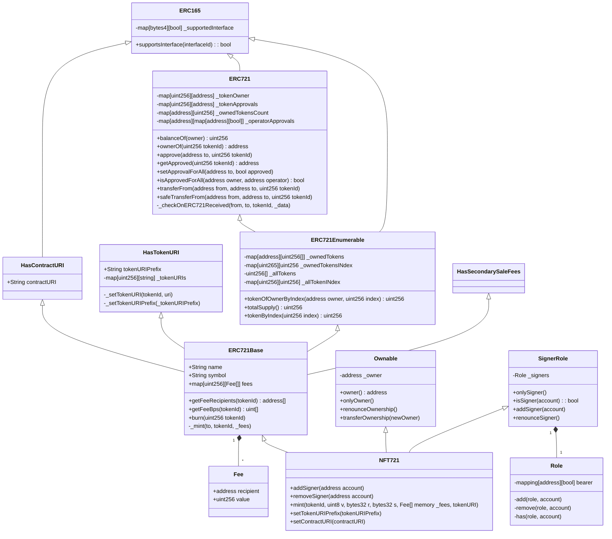
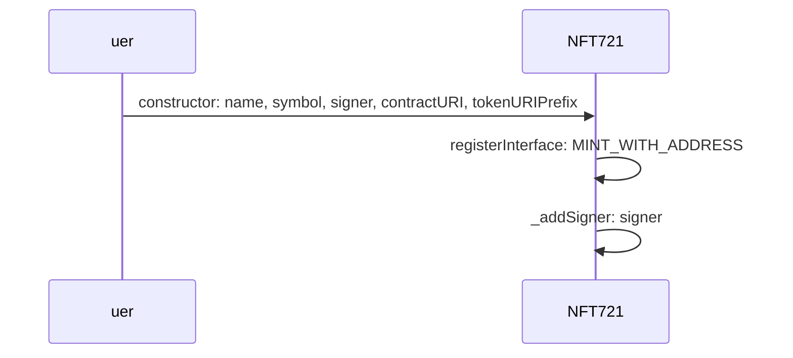
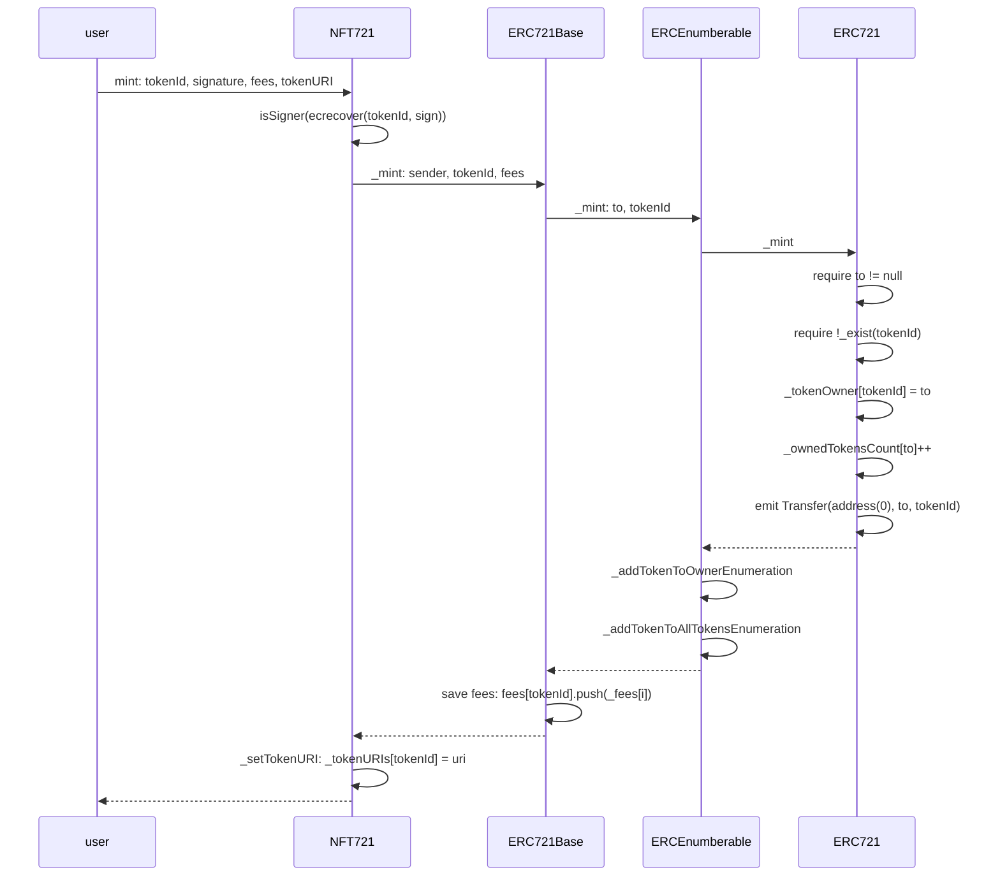
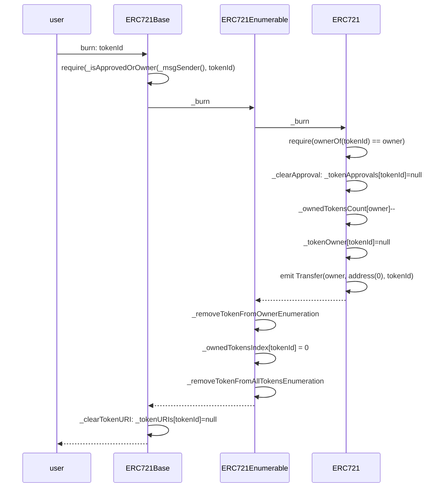
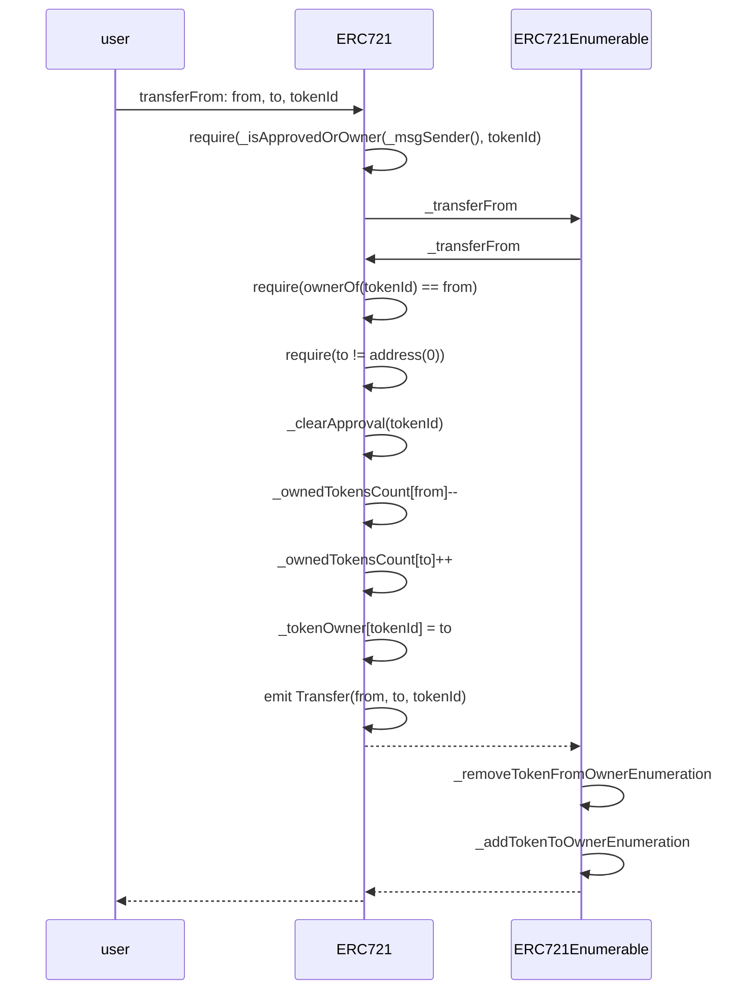
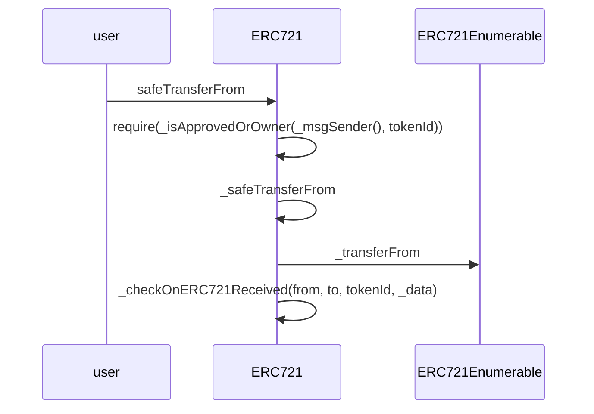
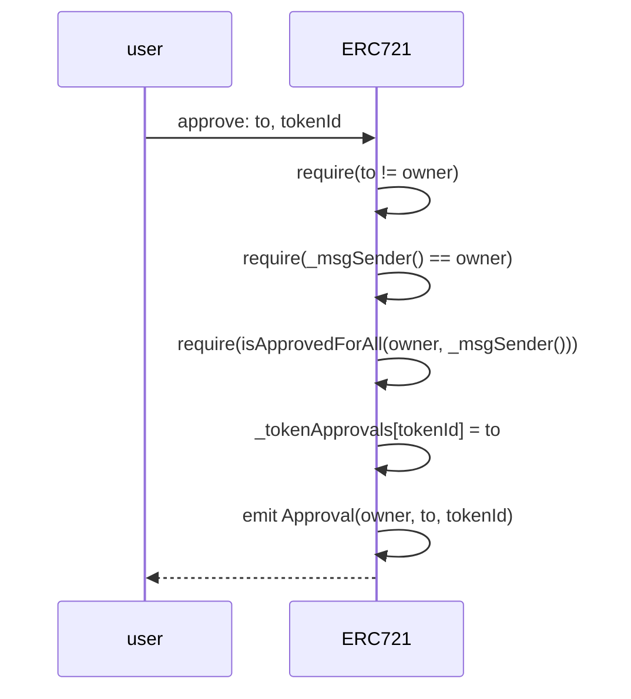
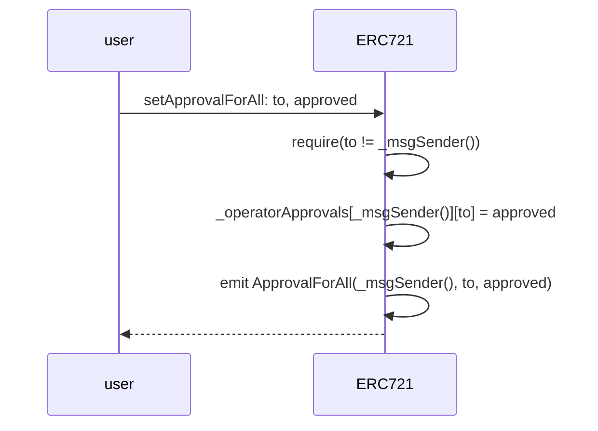

### ERC721

#### Classes



*需要識別一個地址是普通賬戶還是一個合約，合約之間可以相互調用*


*NFT721 mint接口要求提供所有者對tokenId的簽名，並且使用ecrecover方法恢復簽名者帳號*

```solidity
function mint(uint256 tokenId, uint8 v, bytes32 r, bytes32 s, Fee[] memory _fees, string memory tokenURI) public {
        require(isSigner(ecrecover(keccak256(abi.encodePacked("\x19Ethereum Signed Message:\n32", keccak256(abi.encodePacked(this, tokenId)))), v, r, s)), "owner should sign tokenId");
        _mint(msg.sender, tokenId, _fees);
        _setTokenURI(tokenId, tokenURI);
}
```

#### Flows

##### Initialization



##### Mint



##### Burn



##### Transfer



##### Safe Transfer



##### Approve

*Approves another address to transfer the given token ID*



##### Approve for all

*An operator is allowed to transfer all tokens of the sender on their behalf*




