# GIOT 链码实现

### 需求

- 作为组织管理员，我希望在合约中注册组织，client和broker设备，以确定数据的发布和使用者身份
- 作为组织管理员，我希望可以批量管理设备和数据
- 作为组织管理员，我希望特定client在特定的broker上发布信息，以保护数据的来源
- 作为组织管理员，我希望特定的client在特定的broker上接收信息，保证数据被恰当的使用
- 作为组织管理员，我希望组织的数据能够安全传输而不被窃听
- 作为组织管理员，我希望接收的数据是完整的
- 作为组织管理员，我希望将数据分享给特定的接收者，以确保数据的安全性
- 作为组织管理员，我希望客户端可以连接不同的broker，以避免单点故障造成系统不可用

### 模型

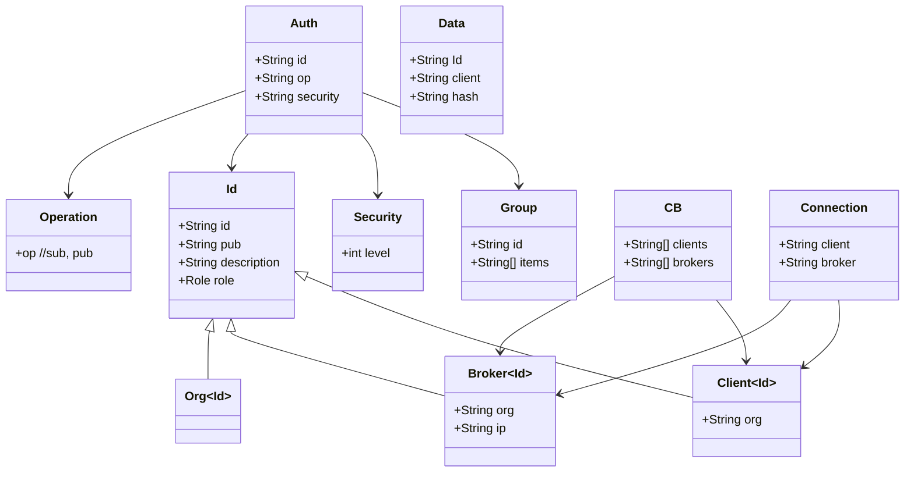

### 流程

#### 身份管理

##### 注册组织

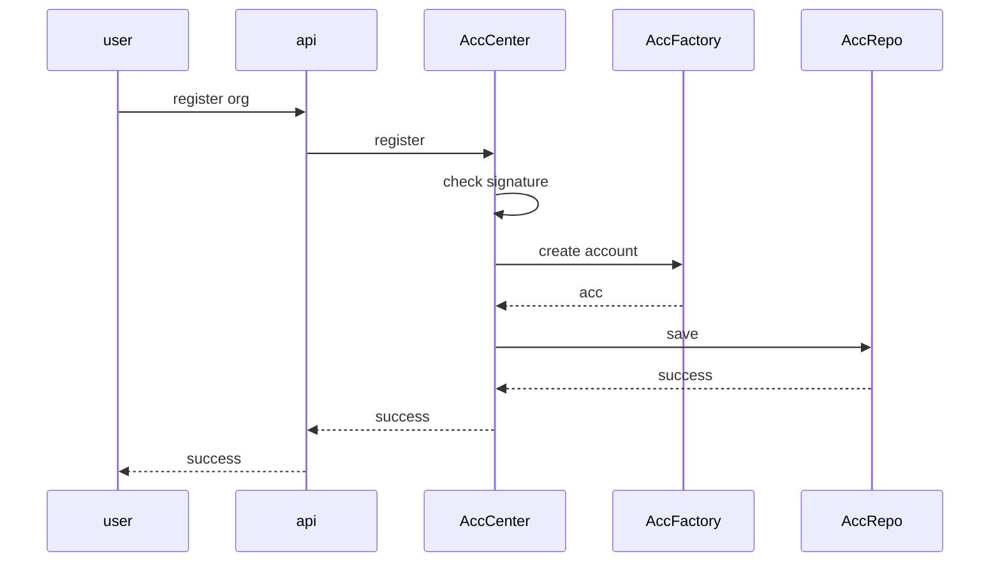

##### 注册Client/Broker

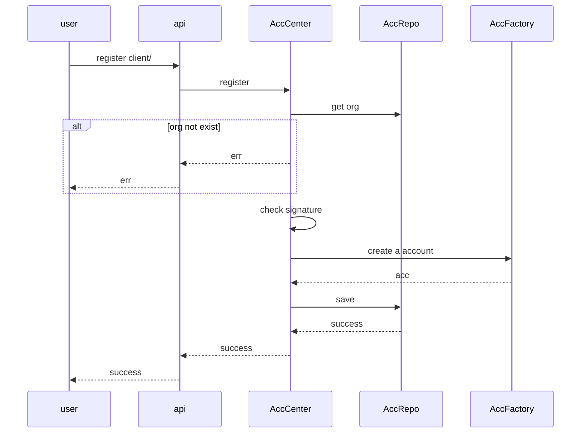

##### 查询身份

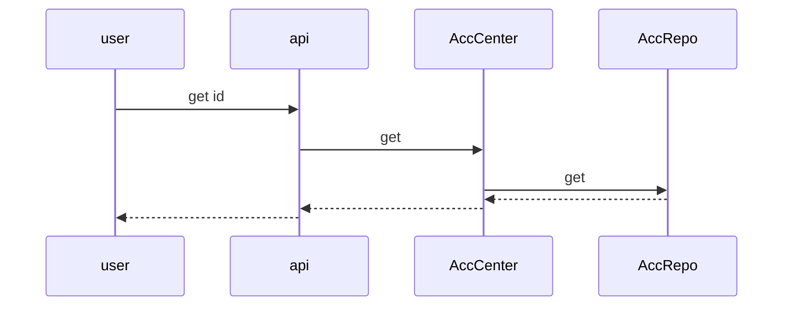

##### 删除身份

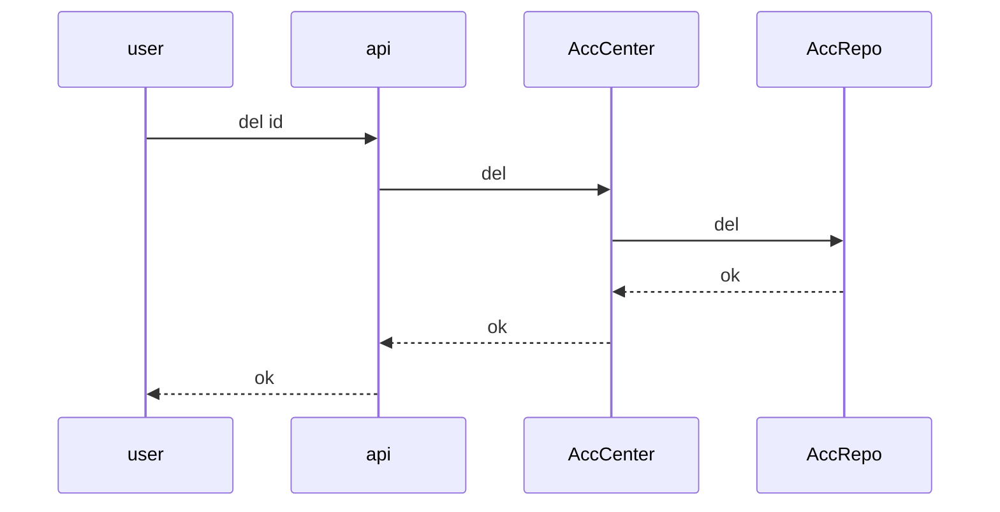


#### 组管理

##### 创建组

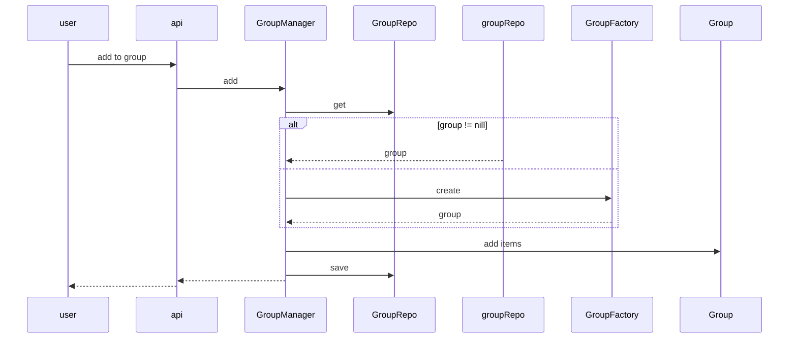

##### 查询组

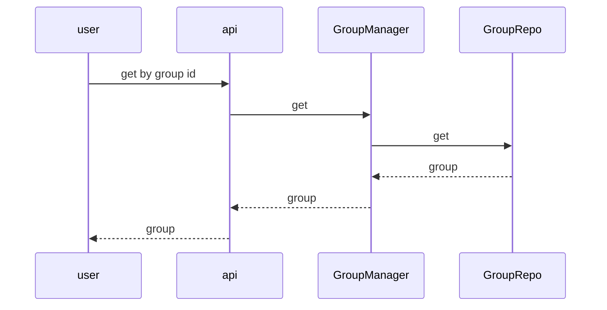

##### 通过身份Id查询组Id

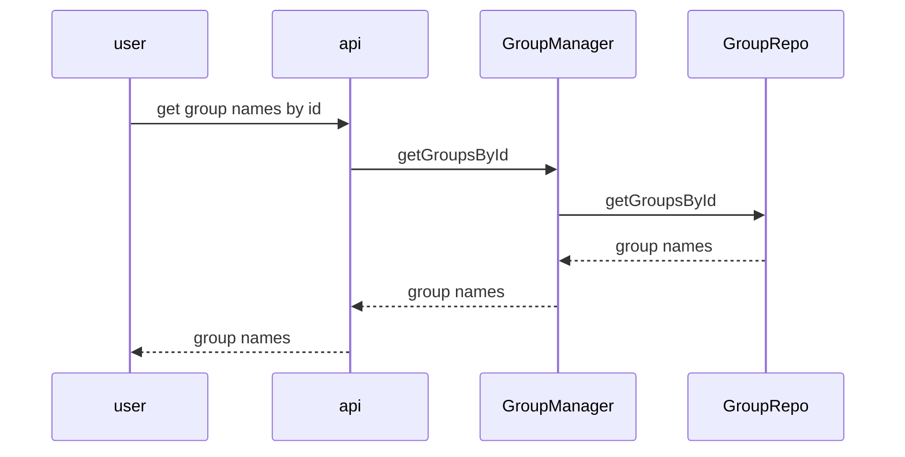

##### 删除组

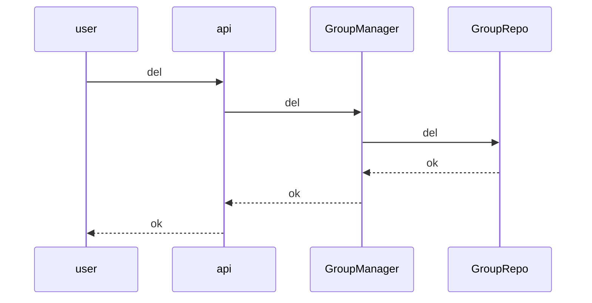

##### 将身份移出组

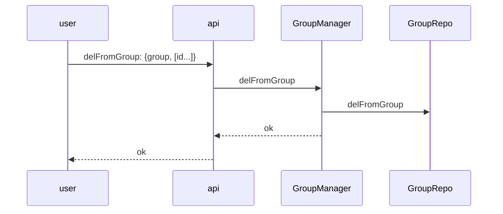


#### 权限管理

##### 授权

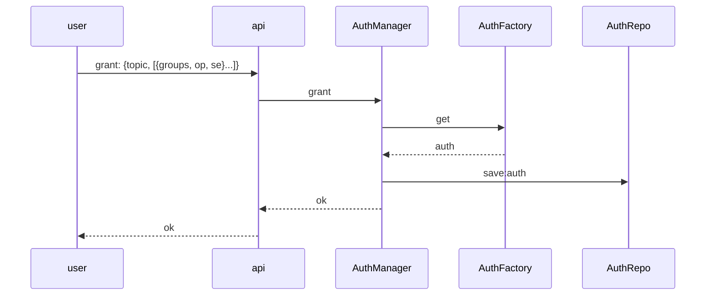

##### 鉴权

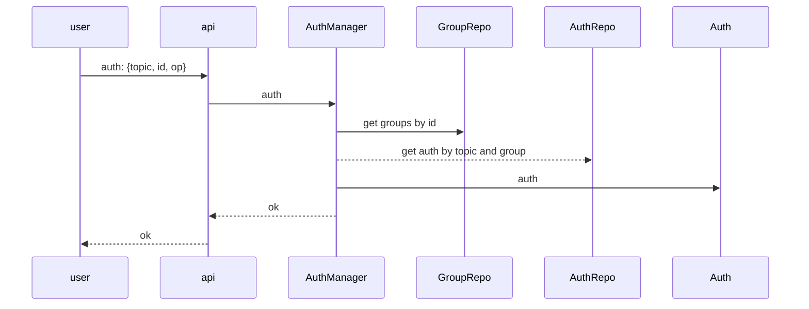

##### 查找授权

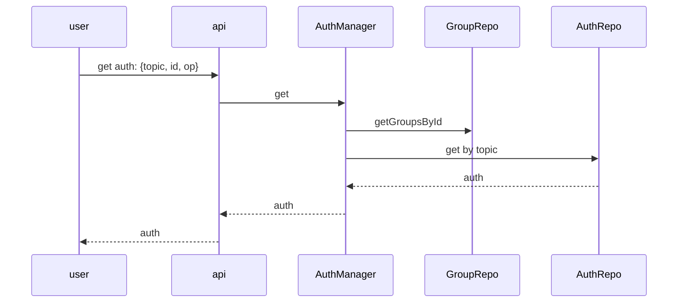

##### 取消授权

通过将Id移出相关的组实现

#### 网络管理

##### 设置client可连接的broker

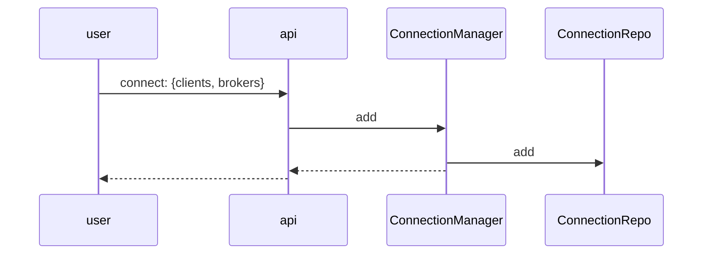

##### 获取client可连接的broker

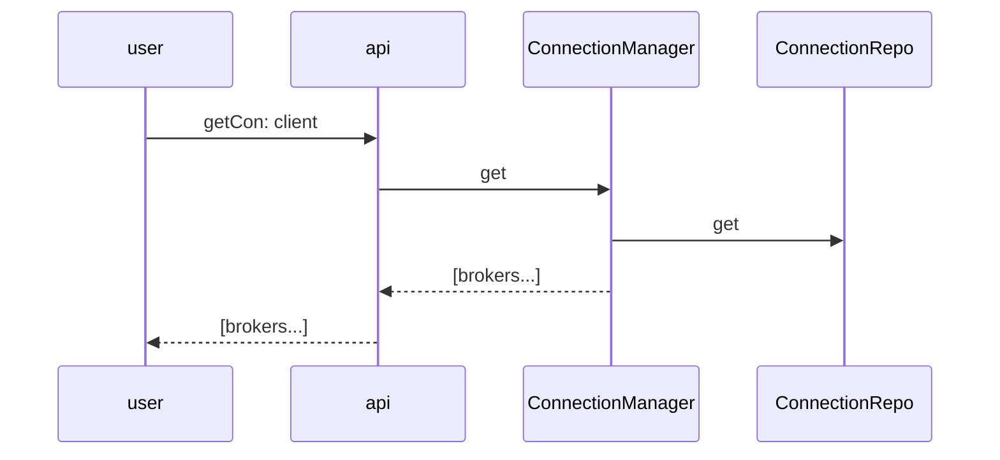

##### 移除client和broker的连接


##### 记录当前连接

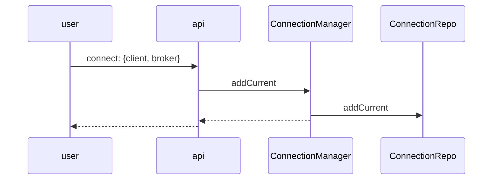

##### 获取当前连接

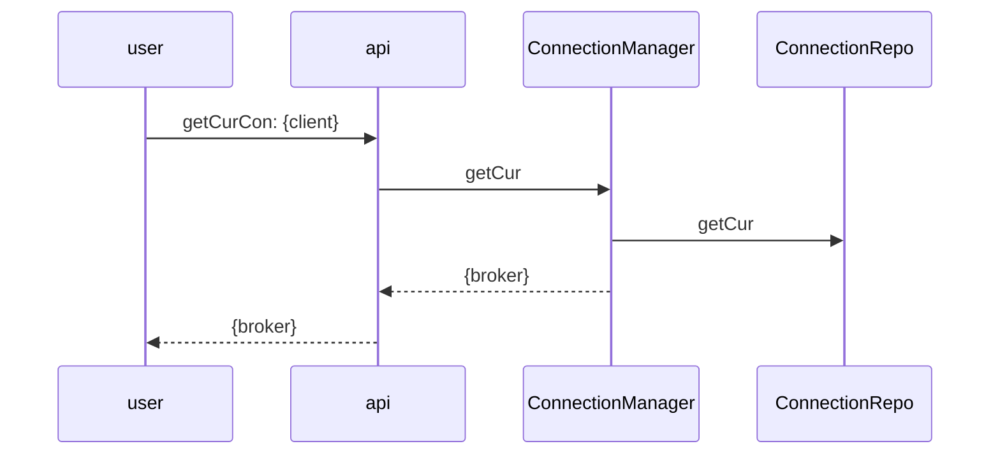

##### 断开当前连接

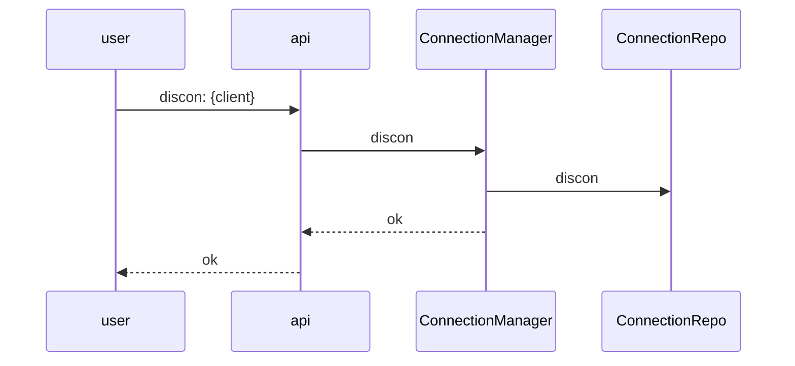

#### 数据管理

##### 上传数据Hash

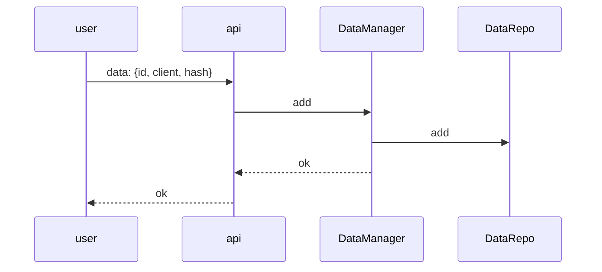

##### 获取数据Hash

```mermaid
sequenceDiagram
    user->>api: getData: {id, client}
    api ->>DataManager: get
    DataManager ->> DataRepo: get
    DataManager -->> api: {hash}
    api -->> user: {hash}
```

### 框架设计

##### 系统框架


##### 合约代码框架

- api  //处理外部请求，参数转换
- models //核心模型
- business //业务流程
- frameworks  //框架相关，如持久化