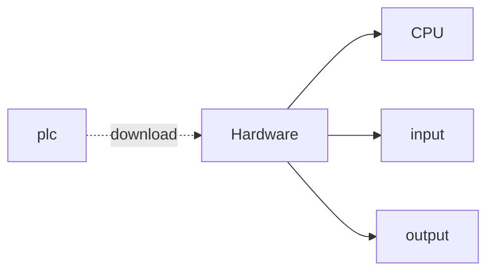

# S7-1500PLC

### 西門子PLC概述

#### 西門子PLC介紹


#### 軟件安裝


### S7-1500PLC編程入門


#### 軟件使用介紹

#### 硬件組態




*所謂的PLC程序的本質是建立輸入和輸出的關係*

#### 變量和數據類型


*DW和Int的區別：DW無符號 Int有符號*


#### PLC觸點與線圈

#### LAD

面向電器工程人員


#### FBD：Function Block Diagram

面向電子工程人員


*開發調試流程*

*完成程序塊->拖到主程序調用->下載到設備->監控*

#### SCL： **Structured Control Language**

面向程序員

*lad 和 fbd中都可以插入scl， scl是底層語言*


*用變量表監控狀態*

#### 電機的正反轉案例


LAD


FBD


SCL


#### PLC 觸點置位及復位


LAD

置位S 復位R


置位/復位位域，即批量操作


置位優先， 復位優先，兩個按鈕同事按則有優先作用


FBD


SCL


#### 局部報警案例


```scl
IF switch THEN
    autoLight := 1;
ELSE 
    autoLight := 0;
END_IF;

IF falt1 OR falt2 OR falt3 THEN
    alert := TRUE;
END_IF;

IF reset THEN 
    alert := FALSE;
END_IF;

IF alert AND clock_10Hz THEN
    faltLight := 1;
    faltSound := 1;
ELSE
    faltLight := 0;
    faltSound := 0;
END_IF;
```

#### PLC上升沿與下降沿


添加組織塊


函數塊： 將自身的值永久存儲在背景數據塊中的代碼塊，從而在程序執行後這些值仍然可用，即自動創建一個DB塊，裏面包含static數據

函數：沒有背景數據塊

數據塊：保存程序數據


#### 計數器

##### 加計數器 CTU

加计数器有5个输入输出端，分别为：1.加计数信号输入端——CU；2.复位端——R；3.预设计数值——PV；4.当前计数值——CV；5.计数器信号输出——Q，如下图所示：


每当CU从“0”变为“1”，CV增加1；当CV=PV时，Q输出“1”，此后每当CU从“0”变为“1”，Q保持输出“1”，CV继续增加1直到达到计数器指定的整数类型的最大值。在任意时刻，只要R为“1”时，Q输出“0”，CV立即停止计数并回到0。

##### 減計數器 CTD

减计数器同样也有5个输入输出端，分别为：1.减计数信号输入端——CD；2.值装载端——LD；3.预设计数值——PV；4.当前计数值——CV；5.计数器信号输出——Q，如下图所示：


每当CD从“0”变为“1”，CV减少1；当CV=0时，Q输出“1”，此后每当CU从“0”变为“1”，Q保持输出“1”，CV继续减少1直到达到计数器指定的整数类型的最小值。

在任意时刻，只要LD为“1”时，Q输出“0”，CV立即停止计数并回到PV值。

注意：若当前计数值CV没有被保存，是看不到计数值的，一直显示为“0”。

##### 加減計數器 CTUD

减计数器同样有8个输入输出端，分别为：1.加计数信号输入端——CD；2.减计数信号输入端——CD；3.复位输入端——R；4.值装载端——LD；5.预设计数值——PV；6.当前计数值——CV；7.计数器信号输出1——QU；8.计数器信号输出1——QD，如下图所示：


每当CU从“0”变为“1”，CV增加1，每当CD从“0”变为“1”，CV减少1；当CV>=PV时，QU输出“1”。

当CV<PV时，QU输出“0”；

当CV<=0时，QD输出“1”，当CV>0时，QD输出“0”； CV的上下限取决于计数器指定的整数类型的最大值与最小值。

在任意时刻，只要R为“1”时，QU输出“0”，CV立即停止计数并回到0；只要LD为“1”时，QD输出“0”，CV立即停止计数并回到PV值。

#### 計數器案例


輸入：按鈕1 按鈕2 復位按鈕

輸出：指示燈1-10


