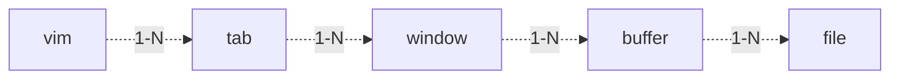

## vim

#### 目標： 不使用鼠標

#### 四大模式

- nomal
- insert
- cmd
- visual

normal： 移动，复制粘贴删除

normal->insert：

```
i  #當前插入
o  #下一行插入空行
a  #append進入
I  #行的開頭插入
A  #行尾追加
###############################
c  #change
caw #change all word 删除当前单词进入输入模式
cc  #删除当前行进入输入模式
c4j #删除下四行进入输入模式

```

insert->normal：

```
ESC  #跳出
ctrl+[ #

```

normal->visual

```
v #visual model
```

normal->exit

```
:q #quit
:q! #quit without save
:w filename # save to filename
:w #save
:wq # save and quit
```

nomal->cmd

```
: 
```


上下左右 k j h l

橫向移動

```
h #left
l #right
0 #line start
^ #line head
$ #line tail
n$ #next n line tail
w #單字跳
W #單字跳過標點符號
b #back word 向前跳
B #back word 跳過標點符號
f x #go to x pos in current line
F x #backward to x pos in current line 
```

縱向移動

```
j # down line
k # up liine
} # down paragraph
{ # up paragraph
G # end of file
gg # begin of file
gj # 跳到區塊的下一行，所謂區塊本身是一行，被編輯器壓縮成多行
zz # 當前行置中
zt # 當前行置頂
zb # 當前行置底
[Control][b] - Move back one full screen
[Control][f] - Move forward one full screen
[Control][d] - Move forward 1/2 screen
[Control][u] - Move back (up) 1/2 screen
:n # go to the nth line
nG # go to the nth line

```

***Search***

```
:set hlsearch # set high light search
:set nohlsearch # set no high light search

/key   #search the key word forward
n # next 
N # backward

?key #search the key word backward

* #search current key
```

***Three imported keys***

```
i # inner xxx
a # around xxx
{ or } # pre paragraph or next paragrapch
```


***Select--Visual***

```
#選取的內容會存到暫存器
v #單字選取
V #行選取
vaw #select word around
va" #select in and including ""
viw #select in word
vi" #select in ""
v[i|a]t #select tags
v[i|a][{|} #select block
ctrl+v #列選取
## conment multiple lines
1. ctrl+v
2. I #go to insert model
3. " #coments all selected lines
4. esc esc 
```

***Copy***

```y yank
yy #複製當前行到暫存器
nyy #複製n行
y$ #copy current pos to line tail
yG #copy current line to end
"[a-z]y #copy to [a-z] register
"[a-z]p #paste from [a-z] register
yaw #复制单词 yank all word
y4j #复制向下4行内容
y4k #复制向上4行内容
y4l #复制向右4行内容
y4h #复制向左4行内容
yfr 复制到r的内容
```

***Set clipboard* **

```
#this will paste content in clipboard by p command 
:set clipboard=unnamed
p #光標之後貼,如果是複製的行，則在當前行之後貼
P #光標之前貼，如果複製的是行，則在當前行之前貼
```

***Insert***

```
i #insert before current pos
I #insert before line head
a #insert after current pos
A #insert after line tail
o #insert new line after current line
O #insert new line before current line
```

***Delete***

```
x #delete current character or selection
d #delete selection
D #delete current to line end
dd #delete line
ndd #delete n lines
dG #delete to file end
dgg #delete to file begin
dnj #delete to new nj lines
dnk
daw #delete word
```

***Change and go to INSERT model***

```
#[c] change, same as [d] but go to insert model
c #delete selection
C #delete current to line end
cc #delete line
ncc #delete n lines
cG #delete to file end
cgg #delete to file begin
cnj #delete to new nj lines
cnk
caw #delete word
```

***Replace***

```
#[r] replace
ra #replace current character by a
```

***indent***

```
:set shiftwidth=8 #indent width,default 8 space
>> #right indent
<< #left indent
> #right indent selection
< #left indent selection
n>> ##right indent n lines
n<< ##left indent n lines
```

***Format***

```
= #format selections
```

***Open file***

```
1. vim test.sh 
2. vim :e test.sh #switch to tab
```

***Open Multiple Files***

```
:tabe test.sh #meaning tab + e, open test.sh in new tab
:gt #Switch tab one by one
:gT #Switch tab inversely
vim -p file1 file2 #open multiple files by tabs
```

***Windows***

```
:new #open new horiz window
:vnew #open new vertical window
:ctrl + w #switch window
:vim -o file1 file2 #open file1 and file2 horizontally
:vim -O file1 file2 #open file1, file2 vertically
:qa #quit all 
```

***Buffer***



```
A buffer is the in-memory text of a file.
A window is a viewport on a buffer.
A tab page is a collection of windows.
vim file1 file2 file3 #open file1,2,3 in three buffers
:ls # list buffers
:ls
 # 1 %a   "break.sh"  line 5 //%a: current buffer
 # 2 #    "mem.sh"    line 12 //#: previous buffer
 # 3      "port.sh"   line 1
:b3 # show buffer 3
:b filename # show buffer of filename
:bn # show next buffer
:bp # show previous buffer
:bl # show last buffer
:bf # show first buffer
:bd # buffer delete
:tab ba # show all buffers in tabs
ctrl + ^ #switch to previous buffer

```

#### Text Object

***Noun***

```
w = word, 
s = sentence, 
p = paragraph, 
t = tag
單引號， 雙引號， 小括號，中括號， 大括號
```

***Verb***

```
y = yank
p = paste
d = delete
c = change
v = select
```

***Scope***

```
i = inner
a = around
```

***Quantifier***

```
1,2,3...
```

***Combination***

```
[num][y|p|d|v|c][i|a][num][w|s|p|t]

```

#### Other tips

***shrink***

```
zf # zip, shrink the selection
zd # delete, open the shrink
zfip # shrink the paragraph
```

***Uppercase <--> Lowercase***

```
~ 
```

***Repeat operation***

```
.
```

***Multiple lines to one line***

```
J
```

***Delete word in INSERT and in terminal***

```
ctrl + w #delete pre word
ctrl + u #delete pre part of line
```

***Switch between vim and terminal***

```
ctrl+z #to terminal
fg #to vim
----------------------------
:! cmd #exec cmd and not left vim
:r ! cmd #copy the result of cmd
```

***Vim tutor***

```
vimtutor #in terminal
:h xxx #help for xxx

```

#### Settings

```
# ~/.vimrc
set nu
set clipboard=unnamed
set cursorline
set noswapfile

" search
set hlsearch
set ignorecase
set incsearch

" tab & space
set softtabstop=2
set shiftwidth=2
set showtabline=2 "show tab always

set splitbelow "open a new window below
set splitrigh

" color
syntax_on
colorscheme default

" filetype
 filetype on
 filetype indent on
 filetype plugin on
 
" key maping
" map: normal visual 
" nmap: normal
" vmap: visual
" imap: insert
"map jj to Esc in visual model
imap jj <Esc>

" unmap/nunamp/vunmap/iunmap
" iunmap jj # cancel jj
" mapclear # clear all maps
" :h key-notation # show keys
" :map #show all maps
" :nmap <UP> <Nop> # cancel UP in normal model

set ruler #show x and y location
set wrap
set linebreak # wray by word
set showcmd
set scrolloff=3 
set smartcase
" set list #show tab and line spliter
```


#### Auto Commands

***Add {cmd} to the list of commands that Vim will                                                                         execute automatically on {event} for a file matching {pat} autocmd-patterns.***


```
# \s == space
:autocmd BufWritePre * :%s/\s\+$//e
```

#### Manage config

***Two ways***

```
# add new .vim config files and source them in ~/.vimrc
# appearance.vim
set ruler #show x and y location
set wrap
set linebreak # wray by word
set showcmd
set scrolloff=3 
set smartcase

# ~/.vimrc
...
source ~/appearance.vim
...
```

```
#使用vim自己的配置文件結構
:h vimfiles

# example1
cd ~/.vim && mkdir colors && touch mmc.vim
:colorscheme + ctrl + d
# will show all schemes incuding mmc
blue       default    desert     evening    koehler    morning    pablo      ron        slate      zellner
darkblue   delek      elflord    industry   mmc      murphy     peachpuff  shine      torte

---------------------------------
# example2
cd ~/.vim && mkdir plugin && touch appearance.vim

#appearance.vim
set ruler #show x and y location
set wrap
set linebreak # wray by word
set showcmd
set scrolloff=3 
set smartcase

```

#### Plugin

***plugin manage tool: vim-plug***

```
#1. install vim-plug
curl -fLo ~/.vim/autoload/plug.vim --create-dirs \
 https://raw.githubusercontent.com/junegunn/vim-plug/master/plug.vim

#2. add pluins to .vimrc
" Specify a directory for plugins
" - For Neovim: stdpath('data') . '/plugged'
" - Avoid using standard Vim directory names like 'plugin'
call plug#begin('~/.vim/plugged')

" Make sure you use single quotes

" Shorthand notation; fetches https://github.com/junegunn/vim-easy-align
Plug 'junegunn/vim-easy-align'
" Initialize plugin system
call plug#end()

#3. 
:PlugInstall

```

***Vim Airline***

***Nerdtree***

```
# .vimrc add plugin
Plug 'scrooloose/nerdtree', { 'on':  'NERDTreeToggle' }
# map F2 to open and close nerdtree to .vim/plugin/nerdtree.vim
nnoremap <silent> <F2> :NERDTreeToggle<Enter>
```

```
m #show cmd

NERDTree Menu. Use j/k/enter, or the shortcuts indicated
=========================================================
  (a)dd a childnode
  (m)ove the current node
  (d)elete the current node
  (c)opy the current node
  print (p)ath to screen
  (l)ist the current node
> Run (s)ystem command in this directory

a # then type a to add a dir or file

m #rename file


j k # move
enter # confirm
o # open and close
ctrl + w #switch between windows

I # show and hide invisible files
C # enter dir
U # out dir
```

***ctrlp***

```
#install
...
Plug 'ctrlpvim/ctrlp.vim'
...
```


```
# https://github.com/ctrlpvim/ctrlp.vim
Basic Usage
Run :CtrlP or :CtrlP [starting-directory] to invoke CtrlP in find file mode.
Run :CtrlPBuffer or :CtrlPMRU to invoke CtrlP in find buffer or find MRU file mode.
Run :CtrlPMixed to search in Files, Buffers and MRU files at the same time.
Check :help ctrlp-commands and :help ctrlp-extensions for other commands.

Once CtrlP is open:
Press <F5> to purge the cache for the current directory to get new files, remove deleted files and apply new ignore options.
Press <c-f> and <c-b> to cycle between modes.
Press <c-d> to switch to filename only search instead of full path.
Press <c-r> to switch to regexp mode.
Use <c-j>, <c-k> or the arrow keys to navigate the result list.
Use <c-t> or <c-v>, <c-x> to open the selected entry in a new tab or in a new split.
Use <c-n>, <c-p> to select the next/previous string in the prompt's history.
Use <c-y> to create a new file and its parent directories.
Use <c-z> to mark/unmark multiple files and <c-o> to open them.
Run :help ctrlp-mappings or submit ? in CtrlP for more mapping help.

Submit two or more dots .. to go up the directory tree by one or multiple levels.
End the input string with a colon : followed by a command to execute it on the opening file(s): Use :25 to jump to line 25. Use :diffthis when opening multiple files to run :diffthis on the first 4 files.
```

***emmet-vim***

```
# autocompletion for html and css 
# https://github.com/mattn/emmet-vim
#install
...
Plug 'mattn/emmet-vim'
...
```

***vim-surround***

```
#Surround.vim is all about "surroundings": parentheses, brackets, quotes, XML tags, #and more. The plugin provides mappings to easily delete, change and add such #surroundings in pairs.
# https://github.com/tpope/vim-surround
#install
...
Plug 'tpope/vim-surround'
...

#use
# S: surroud
1. select content
2. S" #surround selection by "
# d: delete
ds" # delete ""
# c: change
cs"' # change " to '
cs'<div> # change ' to <div>
cst<div><span> # change tag <div> to <span>

```

***vim-snipmate***

```
SnipMate aims to provide support for textual snippets, similar to TextMate or other Vim plugins like UltiSnips. For example, in C, typing for<tab> could be expanded to

for (i = 0; i < count; i++) {
    /* code */
}
with successive presses of tab jumping around the snippet.

#https://github.com/garbas/vim-snipmate
#install
...
Plug 'garbas/vim-snipmate'
...
```

***tagbar***

```
Tagbar is a Vim plugin that provides an easy way to browse the tags of the current file and get an overview of its structure. It does this by creating a sidebar that displays the ctags-generated tags of the current file, ordered by their scope. This means that for example methods in C++ are displayed under the class they are defined in.
#https://github.com/preservim/tagbar
#install
...
Plug 'preservim/tagbar'
...
```


#### Color scheme

https://github.com/tomasr/molokai

https://github.com/morhetz/gruvbox

https://github.com/vim-scripts/wombat256.vim

install: put .vim file to .vim/colors/


***vimcolors.com***


# NVIM-TREE

## KeyBindings

### Default actions

- `<CR>` or `o` on the root folder will cd in the above directory

- `<C-]>` will cd in the directory under the cursor

- `<BS>` will close current opened directory or parent

- type

   

  ```
  a
  ```

   

  to add a file. Adding a directory requires leaving a leading

   

  ```
  /
  ```

   

  at the end of the path.

  > you can add multiple directories by doing foo/bar/baz/f and it will add foo bar and baz directories and f as a file

- type `r` to rename a file

- type `<C-r>` to rename a file and omit the filename on input

- type `x` to add/remove file/directory to cut clipboard

- type `c` to add/remove file/directory to copy clipboard

- type `y` will copy name to system clipboard

- type `Y` will copy relative path to system clipboard

- type `gy` will copy absolute path to system clipboard

- type `p` to paste from clipboard. Cut clipboard has precedence over copy (will prompt for confirmation)

- type `d` to delete a file (will prompt for confirmation)

- type `D` to trash a file (configured in setup())

- type `]c` to go to next git item

- type `[c` to go to prev git item

- type `-` to navigate up to the parent directory of the current file/directory

- type `s` to open a file with default system application or a folder with default file manager (if you want to change the command used to do it see `:h nvim-tree.setup` under `system_open`)

- if the file is a directory, `<CR>` will open the directory otherwise it will open the file in the buffer near the tree

- if the file is a symlink, `<CR>` will follow the symlink (if the target is a file)

- `<C-v>` will open the file in a vertical split

- `<C-x>` will open the file in a horizontal split

- `<C-t>` will open the file in a new tab

- `<Tab>` will open the file as a preview (keeps the cursor in the tree)

- `I` will toggle visibility of hidden folders / files

- `H` will toggle visibility of dotfiles (files/folders starting with a `.`)

- `R` will refresh the tree

- Double left click acts like `<CR>`

- Double right click acts like `<C-]>`

- `W` will collapse the whole tree

- `S` will prompt the user to enter a path and then expands the tree to match the path

- `.` will enter vim command mode with the file the cursor is on

- `C-k` will toggle a popup with file infos about the file under the cursor
