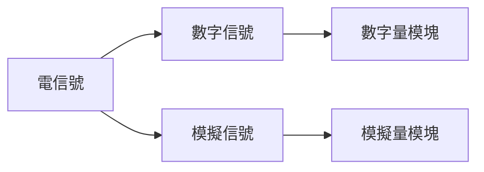

### 西門子S7-1500 PLC筆記

#### PLC系統認知

PLC--自動化產線的大腦 

P -- Programmable

L --- Logic

C --- Controller

#### PLC 發展歷史

起源 20世紀70年代  PDP-14  美國DEC公司

實用化 20世紀70年代- 80年代 SC系列 日本富士電機

快速發展 20世紀80年代-90年代 S5系列 德國西門子

進步和完善 20世紀末-至今 S7系列 德國西門子

常見廠家

#### 常見PLC系統組成

***PLC主站***

***分佈式IO從站***

***人機界面(HMI)***

***工業控制軟件***

#### 主站電源模塊

##### PM電源模塊

電源：向電子設備提供功率的裝置，也稱電源供應器

***PM電源模塊***  PM Module Power Supply

***PM電源模塊的接線和開關***

***狀態顯示***

#####  PS電源模塊  PS(System Power Supply)

爲CPU，信號模塊及其他擴展模塊提供工作電力

***PS電源模塊的狀態顯示***

##### PM/PS區別

***區別的本質原因***

##### 背板總線

總線：系統部件之間傳送數據信息的公共通道

背板總線：PLC控制系統模塊之間傳送數據信息的公共通道

PM：通過外部接線輸出給負載提供外部24VDC工作供電

PS：通過背板總線給負載提供背板工作供電

##### 電源模塊的安裝

***PM電源模塊的安裝***

***PS電源模塊的安裝***

先安裝背板連接器，再將部件插入導軌中

##### PM/PS電源模塊的使用選擇

***可替代性***

PM 可替代， PS應爲通過背板總線連接，所以不可替代

***選擇考量***

使用PM的情況

必須使用PS的情況

#### S7-1500 CPU的使用

##### 認識S7-1500 CPU

***西門子目前最快的自動化控制器***

- 高速背板總線
- CUP命令處理時間可達1ns

***家族成員***

***操作和顯示元件***

##### 安裝

通過背板總線

通過電源線

##### 如何爲項目選擇合適的CPU

***定系列***

安全項目, 需要安全認證 安全型

高可靠性，減少停機 冗餘型

複雜運動控制  運動型

簡單項目，成本有限 緊湊型

沒有任何要求的  普通CPU

***選擇具體型號***

#### 信號模塊

信號：消息的物理量

##### 工業常見信號分類

工業PLC控制系統中使用的絕大部分都屬於電信號

電信號： 數字信號，模擬信號

##### 數字量模塊

***安裝***

***接線***

***數字量模塊接線圖的主要元素***

***常見問題***

如果電壓 在5到11伏特之間，則此信號無效

##### 模擬量模塊

***安裝***

***接線***

***接線圖***

***常見問題***

##### 如何看模塊的參數

***看什麼***

***在哪看***

#### 分佈式IO從站

##### 意義

##### ET200分佈式IO從站家族

MP 和 SP比較主流

##### 常見工業網絡類型

***PROFIBUS DP***

***PROFINET IO 一種以太網協議***

##### 如何再工業現場中佈置分佈式IO從站

- 靠近被控設備
- 考慮工業現場整體佈局

- 設備性能參數

#### ET 200SP 

##### ET200SP 系統構成概述

SIMATIC ET 200SP

高度靈活的可擴展分佈式IO系統，用於通過現場總線將過程信號連接到上一級控制器

- 緊湊型設計
- 易用使用
- 高性能
- 安全集成
- 多種通訊協議

***組成***

***接口模塊***

***接口模塊安裝***

***接線***

***總線適配器***

##### 基座單元

##### 電子模塊

##### 服務器模塊

#### TIA Portal

Totally Integrated Automation, 全集成自動化， 西門子重新定義自動化的概念，平臺以及標準的自動化工具平臺

##### STEP7 (TIA Portal) - 新一代控制器軟件

***一個PLC項目包含兩部分：硬件配置和程序塊***

##### 爲信號模塊分配輸入輸出地址

地址分配範圍，由CPU決定

I0.0 表是輸入信號第0個字節第0個位

#### 概述

軟件：西門子博途

內容包括三種語言：

- LAD(梯形圖) 

- FBD(功能塊圖)
- SCL(結構化控制語言)

#### S7-1500 PLC 介紹

PLC: 

- Programmable Logic Controller 
- 工業控制的核心部分
- 可編程存儲器存儲程序
- 執行邏輯運算， 順序控制，定時，計數，計算等面向用戶的指令
- 通過數字或模擬輸入輸出控制各種機械或生產過程

種類：

- LOGO 低端
- S7-200 低端緊湊
- S7-1200 低端小型，取代S7-200
- S7-300 中端自動化
- S7-400 高端自動化
- S7-1500 高端自動化

S7-1500 PLC 優點

- CPU具有LED屏，方便顯示狀態和故障信息
- 處理速度更快
- 聯網能力更強
- 診斷能力和安全性更高

#### 博途V14軟件安裝

***在萬能的淘寶購買軟件下載和安裝服務***

#### 1500PLC 編程入門

##### 軟件基本使用

TIA: Totally Integrated Automation

- 創建新項目
- 打開項目視圖
- 添加設備

##### 硬件組態

定義：將PLC模塊進行配置，分配物理地址，包括電源，CPU，開關量輸入、輸出，模擬量輸入、輸出，通訊模塊等

CPU 有兩個ip地址，說明有兩個網卡

將CPU打開，左邊是X2，右邊是X1 

如下硬件組態有三個模塊：CPU， INPUT 和 OUTPUT

##### 操作

- 新建項目
- 添加CPU， 選擇S7-1500， CPU 如上圖1516-3PNDP, 選擇訂貨號， 固件版本號
- 在硬件目錄中選擇要添加的輸入模塊DI， 輸出模塊DQ

- 將pc和組態CPU置於同網絡進行聯網
- 將軟件下載到組態

- 創建變量

- 監視變量

- 編寫程序： 按下按鈕，指示燈亮，

編寫代碼

測試

##### 變量和數據類型

變量定義：值可變，包含變量名稱，數據類型，地址，保持性，及其他功能與註釋

變量名稱： 允許使用字母，數字，特殊字符，不建議使用預留關鍵字，不允許使用引號，可以使用支持的任何文字，包括中文，這一點和其他語言不同

數據類型：bool(1) byte(8) CHAR(8) WORD(16) DWORD(32) INT(16)  DINT(32) REAL(32) ARRAY STRING STRUCT UDT

地址：

| 符號 | 名稱 | 書寫方式 |
| ---- | ---- | -------- |
| I    | 輸入 |          |

#### 信號模塊

##### 爲信號模塊分配新的輸入和輸出地址

##### 地址分配問題

**地址分配範圍**

**數據類型**

#### 認識PLCSIM仿真軟件

###### TIA Portal 軟件中的PLCSIM

通過S7-PLCSIM，可以在仿真可編程邏輯控制器PLC中執行以及測試所編寫的STEP 7用戶程序

PLCSIM  即 PLC SIMULATOR

#### 分佈式IO從站的配置

##### 在TIA Portal 中完成ET200SP的硬件配置

1.組態接口模塊

2.組態從站的其他模塊

##### ET200SP配置中常見問題

#### 分佈式IO從站和CPU的Profinet連接

##### PN通訊中斷的常見原因及檢查方法

1. 通過ping命令檢查網絡是否故障

2. 是否存在IP地址的衝突

   掃描網絡的IP地址情況

3. 現場是否存在嚴重電磁干擾

   如可能，將有問題的站點移動到控制器附近測試

4. 項目程序是否被修改

   重新下載正確的程序，重啓CPU

#### 編程語言及CPU數據區

##### 常用編程語言

##### CPU常用數據區介紹

#### 基本指令

##### 基本位邏輯指令使用介紹

##### 邊沿觸發指令的功能使用

##### 定時器指令功能使用

##### 計數器

##### 觸發器

#### 常見數據類型轉換指令

#### 程序块的类型和功能

#### 逻辑化编程的实现

#### 电梯控制系统

##### 电梯控制系统结构

控制系统三要素：控制器， 信号连接和被控对象

##### 电梯控制项目环境搭建

配置网络

启动仿真PLC

启动电梯仿真软件，连接仿真PLC

TIA 创建项目

编辑代码，下载程序， 测试

##### 电梯程序設計

##### wincc電梯監控可視化

Wincc概述

Windows Control Center

##### 創建監控畫面

#### 電梯運行監控畫面組態

